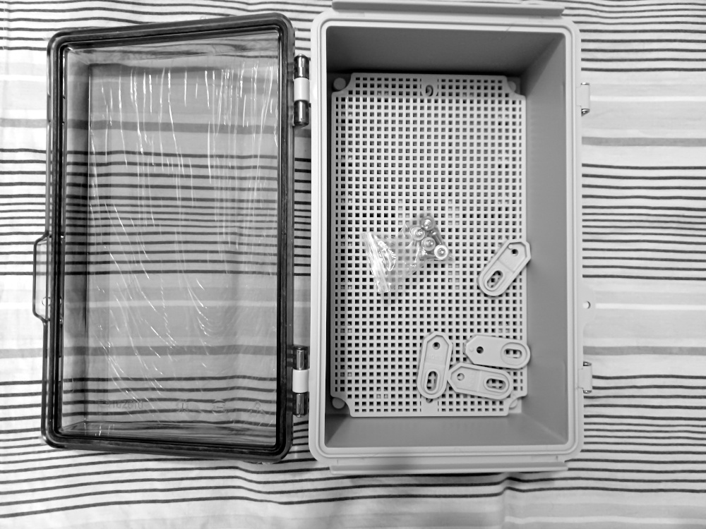
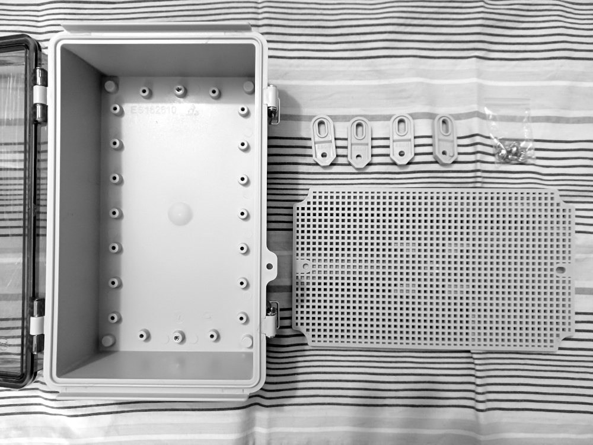
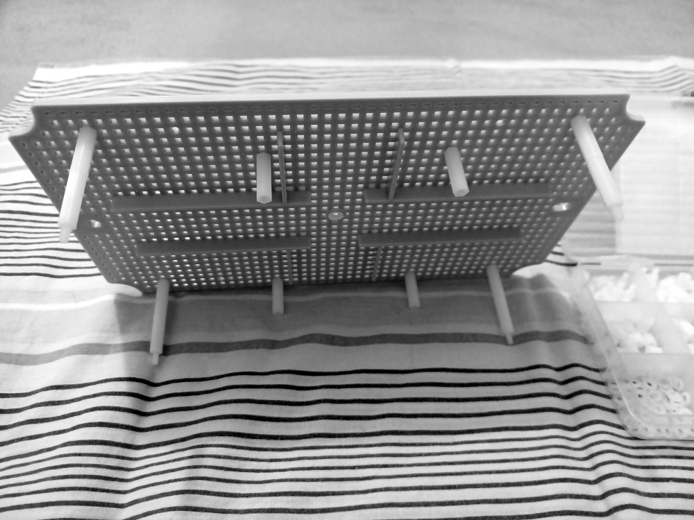

# FWA router on a budget

## The problem

I live in a detached house, in digital divide rural area in Italy. For years I used to buy Internet connectivity from WISP using pure 5GHz WiFi or 28GHz radio (eg. Eolo), but these WISP use to do overprovisioning, so the bandwidth they sell is rarely available. 
Moreover, these solutions (not due to wireless technology limits but to WISP infrastrures) aren't always reliable, so there are availability problems during thunderstorms, windstorms, rainstorms. Internet connection for me is mandatory, doing teleworking.
Due to poor reliability of WISPs I had to setup a 4G backup connection too. But in Italy telco market is always fluid, changing and unpredictable. I bought a 4G SIM from Fastweb, when they were NMVO of Wind. 
I have a WindTre BTS at 1Km in LOS from my home and now this BTS have 5G too. When Fastweb and Vodafone merged, Fastweb begun to use Vodafone infrastructures... but the nearest Vodafone BTS is 3Km away and NLOS! So became very slow!

## The solution

I tried a WindTre SIM and obtained, with a 5G phone, 450/100Mbps! Unfortunately outside only, because inside due to thick walls the speed really slows down. So I decided to unsubscribe all others utilities and subscribe a WindTre FWA (5G router included) or a WindTre unlimited SIM.
But FWA come with inside router only and I hate using consumer chinese routers (expecially if telco customized and locked down). And WindTre FWA and unlimited SIMs are behind CGNAT, so I couldn't have public IP, my own home servers. Moreover with WindTre there are disconnections every 4 hours.
There are telco brokers that sells DeNAT SIM with dynamic public IP address and disconnections every 24 hours. But what about the router? 4G LTE routers are relatively cheap, also CAT6+. Instead, 5G routers are extremely expensive, also chinese ones.
I love MikroTik devices, they are cheap but (usually...) reliable and powerful. But they don't have outside 5G routers and the only inside one they sell, Chateau, is extremely expensive. Also used outside routers are expensive and unobtainable.
So I decided to look for used 5G modules, when succeded to found a pair used and cheap, I decided to build an outside router from scratch! For the router itself I used a MikroTik RouterBoard RBM33G (RBM11G could be used, but oddly it's costlier then RBM33G).

## My making

I bought an electrical waterproof box (with transparent lid, but it was just a whim to made some pictures and this documentation), the [RouterBoard RGB33G](https://mikrotik.com/product/rbm33g), a Kalea Informatique [M.2 to USB3.0 adapter](https://www.kalea-informatique.com/m-2-ngff-3g-4g-5g-module-to-usb-3-0-adapter-with-dual-sim-card-slot-and-power.htm) for 3G/4G/5G modules and an used Fibocom FM150-AE M.2 module.
NB: It's mandatory to found a 4G/5G module with USB3.0 port, not cheap PCIe only because they won't work with RouterBoards. Moreover, M.2 to miniPCIe adapter cannot be used with RouterBoards or the speed will be limited to USB2.0 speed (480Mbps, so not more then ~250Mbps LTE speed).
I bought also a pair of chinese cheap omnidirectional antennas (2x2 MIMO), a waterproof ethernet connector, some M3 and M4 hexagonal spacers (I preferred nylon for M3 and metal for M4, because M3 ones are used to supports PCBs of RouterBoard and adapter and to stabilize the structure while M4 ones are used to mechanically support the entire internal structure into the box). NB: M3 screws don't enter into pre-drilled plate: the holes are squared and narrower. I used to widen the holes I have to use with a small round file.

### RouterOS and modem configuration

RBM33G came with ROS 6.4x, so I upgraded to 7.18 and then 7.19. Configured a bridge, with no spanning tree and addedd bridge1 to LAN interface list, lte1 to WAN interface list:
```
/interface bridge
add name=bridge1 protocol-mode=none
/interface bridge port
add bridge=bridge1 interface=LAN
add interface=lte1 list=WAN
```

Configured lte1 interface with WindTre Unico APN, MBIM mode:
```
/interface lte apn
set [ find default=yes ] default-route-distance=1 ip-type=ipv4 use-network-apn=no
add apn=myinternet.wind default-route-distance=1 ip-type=ipv4 name="WindTre Unico"
/interface lte
set [ find default-name=lte1 ] allow-roaming=no apn-profiles="WindTre Unico" mtu=1480
/interface lte settings
set mode=mbim
```

Configured IP address on LAN interface and DHCP; configured cloud DDNS to find public IP address with DeNAT SIM:
```
/ip address
add address=172.16.20.1/24 interface=bridge1 network=172.16.20.0
/ip cloud
set ddns-enabled=yes
/ip dhcp-server
add address-pool=default-dhcp bootp-support=none interface=bridge1 lease-time=1d name=defconf
/ip dhcp-server config
set store-leases-disk=1h
/ip dhcp-server network
add address=172.16.20.0/24 dns-server=172.16.20.1 gateway=172.16.20.1
/ip pool
add name=default-dhcp next-pool=default-dhcp ranges=172.16.20.2-172.16.20.254
```

Configured the firewall and NAT (with hw offload for LAN), tarpitting of port scanning, limited ICMP:
```
/ip firewall filter
add action=fasttrack-connection chain=forward comment="accept estab,related,untrack (fasttrack)" connection-state=established,related,untracked hw-offload=yes
add action=accept chain=input comment="accept estab,related,untrack" connection-state=established,related,untracked
add action=drop chain=forward comment="drop invalid" connection-state=invalid log=yes
add action=drop chain=forward comment="drop all from WAN not DSTNATed" connection-nat-state=dstnat connection-state=new log=yes out-interface-list=WAN
add action=drop chain=input comment="drop invalid" connection-state=invalid log=yes
add action=add-src-to-address-list address-list=scanners address-list-timeout=none-dynamic chain=input comment="detect portscan -> list scanners" in-interface-list=WAN protocol=tcp psd=5,3s,3,1
add action=tarpit chain=input comment="tarpit if into list scanners" in-interface-list=WAN protocol=tcp src-address-list=scanners
add action=accept chain=input comment="accept ICMP (limited 1pkt/s)" limit=1,5:packet protocol=icmp
add action=accept chain=input comment="allow neighbour discovery (from !WAN)" dst-port=5678 in-interface-list=!WAN protocol=udp
add action=accept chain=input comment="accept all from LAN" connection-state=new in-interface-list=LAN
add action=drop chain=input comment="drop any from !LAN" in-interface-list=!LAN log=yes
/ip firewall mangle
add action=change-mss chain=forward comment="clamp MSS to path MTU" disabled=yes new-mss=clamp-to-pmtu protocol=tcp tcp-flags=syn
/ip firewall nat
add action=masquerade chain=srcnat comment="masquerade to lte1" out-interface-list=WAN
```
Obviously my configuration is more complex, I have VPN, dynamic routing and the "LAN" actually is a DMZ... but for security and privacy reason I omitted it ;-)

## Upgrades

Before installing the routing outside, I did some changes and upgrades to it. I moved the boards of a pair of hole (due to the USB cable too bent and tensioning USB connectors) and changed the USB cable with a braided nylon one. Moreover I found an used Quectel RM502Q-GL, for sure faster and with better band aggregation than the Fibocom FM150-AE, so I'm going to change also the modem.

| | |
| ------------- | ------------- |
| Waterproof electrical junction box and its pre-drilled plate:| Details of the parts and the pre-drilled plate: |
|  |  |
| Box parts and a set of M3 nylon hex spacers: | First step of spacers assembly: |
|  |  |
| First step of spacers assembly:| Plate assembly and boxed Kalea Informatique M.2 to USB3.0 adapter: |
|  |  |
| Kalea Informatique M.2 to USB3.0 adapter unboxing:| Kalea Informatique M.2 to USB3.0 adapter in place: |
|  |  |
| Also RouterBoard RBM33G in place:| Detail of the entire internal assembly: |
|  |  |
| USB cable connected thru the boards and 5G module in place:| Temporary antennas for testing: |
|  |  |
| Waterproof box and metal hex spacers in place:| Waterproof connector in place and internal assembly with new USB cable and boards moved |
|  |  |
| Waterproof box and antennas:| Drilled holes for antennas and rubber gasket: |
|  |  |
| Antennas in place on the waterproof box:| Final assembly, yeah! |
|  |  |

